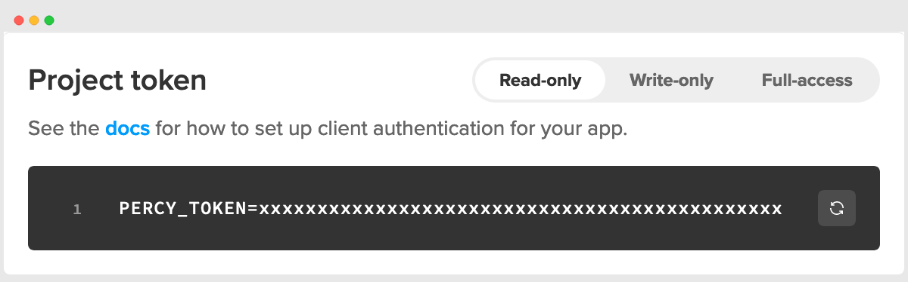
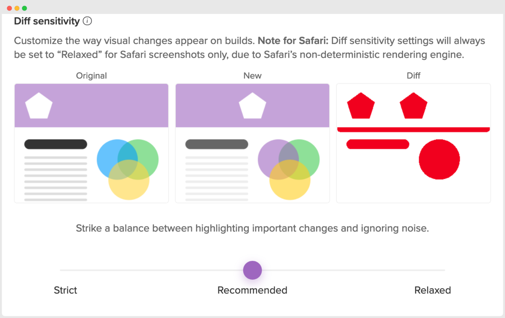

# Portfolio

## Percy

Technologies: _Ruby on Rails, EmberJS, MySQL_

### Percy Enterprise

> October 2022 to March 2023

- Implemented [enterprise support](https://percy.io/enterprise) and role authorizations to coincide with BrowserStack organizations
- Coordinated with stakeholders and customers for seamless migration for existing orgs
- Ironed down specifications with BrowserStack PM and Percy Cofounder
- Lead this project

Commits

|     | Date       | Hash      | Message                                                                         |
| --- | ---------- | --------- | ------------------------------------------------------------------------------- |
| UI  | 2023-04-04 | 353495930 | Dashboard Redirect Preserves Current Team (#3464)                               |
| API | 2023-03-03 | 1c6641bf9 | Enable Teams for Newly-created Enterprise Organizations                         |
| API | 2023-03-02 | 456256b21 | Calculate Usage Stats by Enterprise Team                                        |
| UI  | 2023-03-02 | d8c790469 | Fix Teams Dropdown for all Dashboard Pages                                      |
| UI  | 2023-02-07 | 0119d3b6b | 10:38:44 -0700 Team Admins should only be Members of other teams/groups (#3337) |
| UI  | 2023-01-13 | 3151fb917 | Dropdown for `visibleOrganizationsInGroup`                                      |
| API | 2022-12-05 | e50c97455 | Implement and consume enterprise `TeamData`                                     |
| API | 2022-10-26 | 7704c4b99 | Migration: Add `enterprise_access` to organizations                             |

### Contact Service API and UI Modals

> October 2022 to November 2022

- Front-end focused
- Coordinated with BrowserStack Sales Eng team
- Cross domain support
- Project did not have specifications
- Took a open-ended project off the hands of overloaded coworkers and drove it to completion

https://github.com/user-attachments/assets/a9601665-7694-4a0f-891e-92cf463cf45c

Commits:

|     | Date       | Hash      | Message                                           |
| --- | ---------- | --------- | ------------------------------------------------- |
| UI  | 2022-11-17 | c610aae0d | Quick Contact Sales modal fixes (#3212)           |
| UI  | 2022-11-16 | 12928daaa | Contact Service Functionality (#3117)             |
| API | 2022-10-07 | 286db71b1 | Better Contact Service API Error Handling (#2853) |
| API | 2022-10-06 | 1935d9ee7 | Contact Service API (#2825)                       |

### Major Ruby and Rails Version Upgrades

> July 2022 to September 2022

- Regular maintenance
- Upgrade Rails from `6.1.6.1` to `7.0.3.1` (2022-08-04 f6e091ac7)
- Upgrade Ruby from `2.7` to `3.1` (2022-09-15 5ce972cac)
- Optimize slow-running queries with Bullet
- Remove unused and redundant gems

Commits:

|     | Date       | Hash      | Message                                                                  |
| --- | ---------- | --------- | ------------------------------------------------------------------------ |
| API | 2022-09-15 | 5ce972cac | Adopt Ruby 3.1 (#2809)                                                   |
| API | 2022-09-13 | b259326be | Update baseimage to Ruby 3 (#2781)                                       |
| API | 2022-09-12 | d5c66e5e1 | Preparation for Ruby 3 Upgrade (#2747)                                   |
| API | 2022-09-07 | 21f07a8d2 | Update `percy-style` to target Ruby 2.7 syntax (#2786)                   |
| API | 2022-08-26 | 979b7d288 | Update to new Ruby 3 compatible `percy-workloads` gem (#2779)            |
| API | 2022-08-10 | 6ac17fe22 | Serialize precision: nil for tables where datetime precision was not set |
| API | 2022-08-05 | 92980dbf2 | Rails `7.0.3.1` Upgrade (take two) (#2728)                               |
| API | 2022-08-04 | f6e091ac7 | Revert "Upgrade Rails from `6.1.6.1` to `7.0.3.1` (#2715)" (#2727)       |
| API | 2022-08-04 | f14135713 | Upgrade Rails from `6.1.6.1` to `7.0.3.1` (#2715)                        |
| API | 2022-08-02 | 71efc0b01 | Bullet Query Optimizations (#2720)                                       |
| API | 2022-08-02 | 1e033b50d | Add `Bullet.profile` to print_queries helper (#2721)                     |
| API | 2022-08-02 | 82f74377c | use RubyGems `subprocess` gem :gem: (#2722)                              |
| API | 2022-07-29 | 1ec872645 | Add `print_queries` to sql helper (#2711)                                |
| API | 2022-07-29 | 8374fa6fd | Remove unused `scientist` gem (#2714)                                    |
| API | 2022-07-28 | 9cf987e0d | Remove redundant `JSON::Api::Vanilla` gem (#2709)                        |
| API | 2022-07-28 | 688d1bc6c | Remove no longer used stripe gem (#2710)                                 |

### Data Deletion Service

> November 2021 to July 2022

- Architected pipeline to safely, efficiently, reliably delete stale customer data
- Determined recency of deduplicated assets shared across all organizations
- Leveraged Sidekiq job uniqueness, idempotence to update or delete objects

Commits:

|     | Date       | Hash      | Message                                                                   |
| --- | ---------- | --------- | ------------------------------------------------------------------------- |
| API | 2022-07-14 | ddbbab71d | Delete Associated Comment Threads and Comments (#2670)                    |
| API | 2022-07-13 | e4c1a46b5 | Delete associated Master Snapshot iff deleting latest Snapshot (#2669)    |
| API | 2022-07-12 | b5d007a53 | remove ManifestMigration rake task from cron (#2664)                      |
| API | 2022-07-01 | ecabc5725 | Add `lossy_image` deletion to DeleteImages step (#2648)                   |
| API | 2022-07-01 | 390b1ff25 | Add safeguard for `Google::Cloud::NotFound` error (#2647)                 |
| API | 2022-06-30 | 351933a7a | Remove Auth0 References (#2625)                                           |
| API | 2022-06-29 | 54cfd6b46 | Delete Images Step (#2612)                                                |
| API | 2022-06-16 | 2cb89929  | `resource.uploaded_at` should not affect GCS delete call (#2581)          |
| API | 2022-06-16 | 171ce18e3 | Delete SnapshotResources in bulk (#2582)                                  |
| API | 2022-06-16 | 455a0681b | DeletionService maybe_delete_resource! (#2565)                            |
| API | 2022-06-09 | 0fe5fa441 | fix `sha:` -> `filename:` kwarg in storage_data (#2570)                   |
| API | 2022-06-08 | a0c0c015d | Update percy-storage gem from 1.4.1 to 2.0.5 (#2567)                      |
| API | 2022-06-02 | 68388dc13 | update dev.rake (#2553)                                                   |
| API | 2022-06-02 | b45dc84f1 | Add sidekiq-deletion queue (#2554)                                        |
| API | 2022-05-10 | 99ec80c39 | delete update reused object job (#2488)                                   |
| API | 2022-03-17 | aa67ebd41 | Better Honeycomb Tracing for Object Ledger Service (#2371)                |
| API | 2022-03-12 | 14a3d9795 | Fix zscan return type for flush object ledger (#2359)                     |
| API | 2022-03-11 | 02eecac39 | Fix `OBJECT_TYPES` class variable reference (#2358)                       |
| API | 2022-03-11 | 0b74b6bdb | Decouple Image and Resource Updates + Batch Update Retries (#2337)        |
| API | 2022-03-08 | 9da156854 | Delete bulk segment update job (#2346)                                    |
| API | 2022-03-02 | e77470469 | [UpdateReusedObjects] More Logging and Re-enqueue on Success (#2332)      |
| API | 2022-03-02 | 54d823354 | Delay Cron Timings for Object Ledger Flush (#2323)                        |
| API | 2022-02-22 | 02c3298fb | Batch Object Ledger Flushes (#2294)                                       |
| API | 2022-02-03 | 9f06d8b65 | Object Ledger Service: more Honeycomb logging + update in batches (#2290) |
| API | 2022-01-31 | 3b67a8670 | Object Ledger: Rename Honeycomb Trace + Add `nil` compact (#2284)         |
| API | 2022-01-28 | dec79d941 | Backfill Reused Object Updates (#2215)                                    |
| API | 2022-01-21 | a9f2072d2 | Flush Object Ledger Updates (#2229)                                       |
| API | 2021-12-07 | f310ef40c | Object Ledger Service Touchpoints (#2211)                                 |
| API | 2021-11-10 | 50f870cd5 | Introduce Object Ledger Service (#2205)                                   |
| API | 2021-11-05 | 0c98249f5 | Add development redis instance for object ledger (#2204)                  |

### Upsell Browser Configuration and Automatic Usage Notifications

> August 2021 to September 2021

- Product restrictions via API and paywall modals to upsell browser configuration
- Automatic usage notifications at 75% and 100% for paid plans
- Automated transactional emails for organization plan usage

Commits:

|     | Date       | Hash      | Message                                                   |
| --- | ---------- | --------- | --------------------------------------------------------- |
| UI  | 2021-09-10 | 691a99d30 | Upsell Browser Configuration to New Orgs                  |
| UI  | 2021-08-16 | e1226f990 | Add note about automatically sending usage notifications  |
| API | 2021-09-10 | 2fec94e0a | Upsell Browser Configuration                              |
| API | 2021-08-24 | 0255ac546 | Bulk project browser creation/deletion as paid features   |
| API | 2021-08-16 | 03176c5e1 | Automatic usage notifications                             |
| API | 2021-08-04 | dc334358d | Endpoints for bulk ProjectBrowserTarget creation/deletion |

### API Documentation and Strict API Token Management

> July 2021

- Publicly-facing API and self-updating interactive [reference documentation](https://www.browserstack.com/docs/percy/api-reference/authentication) (Swagger, OpenAPI)
- Access token rotation

Commits:

|     | Date       | Hash      | Message                                              |
| --- | ---------- | --------- | ---------------------------------------------------- |
| API | 2021-07-22 | d055a301e | Migration for backfilling readonly tokens            |
| UI  | 2021-07-20 | e988a01fe | Expose ReadOnly token in UI                          |
| API | 2021-07-20 | bc8476b86 | API Documentation with rswag                         |
| API | 2021-07-06 | db600e01d | [Public API] Add Support for Project ReadOnly Tokens |

### Visual Diff Sensitivity

> May 2021 to June 2021

- Created slider component for demonstrating visual diff
- Added relevant column to Project model and API
- Placed behind feature flag to confirm adoption duringn A/B test

Commits:

|     | Date       | Hash      | Message                                                  |
| --- | ---------- | --------- | -------------------------------------------------------- |
| UI  | 2021-06-09 | 1a36792c8 | Remove Diff Sensitivity Feature Flag                     |
| UI  | 2021-06-04 | 3ab5f5278 | Visual Diff Sensitivity                                  |
| API | 2021-06-07 | 20c9e5500 | Do not update Diff Sensitivity if already a custom value |
| API | 2021-06-04 | aadccfe93 | Update Project Fuzz Factor with Diff Sensitivity         |

### Azure DevOps Integration

> February 2021 to May 2021

Commits:

|     | Date       | Hash      | Message                                                          |
| --- | ---------- | --------- | ---------------------------------------------------------------- |
| UI  | 2021-05-18 | ac529a6dc | Azure DevOps Launch                                              |
| API | 2021-04-27 | d505367ed | Better Handle Azure DevOps Errors (#1914)                        |
| API | 2021-03-31 | 034cb8ca5 | Add Pagination to Azure DevOps (#1902)                           |
| API | 2021-03-30 | b95b570c9 | Update Azure DevOps Pull Request Cassettes (#1900)               |
| API | 2021-03-30 | d465581d0 | Azure DevOps Commit Status Update Services (#1899)               |
| API | 2021-03-26 | 6929ab51c | Azure DevOps Pull Request Service (#1898)                        |
| API | 2021-03-25 | e91a26fd4 | update ADO cassettes to fix changed repo name (#1895)            |
| API | 2021-03-25 | 87005baf8 | Azure DevOps Repo Service (#1887)                                |
| API | 2021-03-19 | 84fbecf43 | Azure DevOps Service Setup (#1877)                               |
| UI  | 2021-03-10 | 361dbdf67 | Azure DevOps Integration                                         |
| API | 2021-02-18 | d17c1ea31 | db migration to add azure devops to version_control_integrations |

## Sonder

Technologies: _Ruby on Rails, ReactJS, Postgresql_

### Listings Platform for bulk CRUD operations

> November 2019 to March 2020

- Owned Listings Platform

Commits:

|     | Date                      | Hash     | Message                                                                |
| --- | ------------------------- | -------- | ---------------------------------------------------------------------- |
|     | 2020-03-20 19:21:17 -0700 | 034610a1 | reset min-los bound                                                    |
|     | 2020-03-20 17:19:20 -0700 | 5a890624 | [COVID19] Change min LOS to 30 (#1529)                                 |
|     | 2020-03-20 16:19:17 -0700 | 71a30269 | simplify logic and reduce hits to Flipper db (#1527)                   |
|     | 2020-03-20 15:56:41 -0700 | 2005c869 | [COVID19] Cap Homeaway Min LOS to 28 days max (#1525)                  |
|     | 2020-03-20 14:12:03 -0700 | da9bc751 | Time.today to Time.current (#1524)                                     |
|     | 2020-03-20 13:16:52 -0700 | 323f94d1 | [COVID19] Cap Airbnb minimum_stay_length to 28 days (#1522)            |
|     | 2020-03-18 11:08:47 -0700 | 0ed5b721 | Log Listable Upsert Errors (#1492)                                     |
|     | 2020-03-17 19:28:54 -0700 | 981239bb | [LP] Automatically create L1 listings when creating collection (#1486) |
|     | 2020-03-17 14:39:15 -0700 | b98058a3 | add channel booking id to COVID refund log (#1512)                     |
|     | 2020-03-17 13:33:37 -0700 | 45197954 | Add covid19 condition for processing airbnb cancellations (#1511)      |
|     | 2020-03-13 09:59:14 -0700 | 7d7acd8d | Add CUF Spaces to Listable (#1494)                                     |
|     | 2020-03-09 16:09:25 -0700 | 0f3aeffe | increase LOS Discount upper bound (#1482)                              |
|     | 2020-03-03 16:57:25 -0800 | fc3a6f31 | Add migration for new unit amenity fields on Listable (#1471)          |
|     | 2020-03-03 14:44:15 -0800 | 460362c3 | Migration to Add Building Fields to Listable (#1470)                   |
|     | 2020-02-27 17:27:49 -0800 | d61f9a97 | redirect requests to units to respective listable (#1459)              |
|     | 2020-02-27 14:02:29 -0800 | 71529b2f | [LP] Batch Update Homeaway Descriptions (#1456)                        |
|     | 2020-02-27 13:43:52 -0800 | 2760d5b2 | [LP] Show List on Homeaway Button (take-two) (#1450)                   |
|     | 2020-02-25 17:50:45 -0800 | 621ad935 | add internal/external listing links to listable view (#1448)           |
|     | 2020-02-25 17:39:41 -0800 | f6e69016 | Add availability serializer (#1449)                                    |
|     | 2020-02-25 14:23:18 -0800 | 34920efe | [LP] Beautify collection availabilities (#1444)                        |
|     | 2020-02-24 19:40:02 -0800 | 2ecd3f6c | [LP] Listable Details Page + Create Homeaway Listing (#1429)           |
|     | 2020-02-21 11:11:02 -0800 | 7dbb943f | Fix LP namespacing for Listings::Bookingcom (#1435)                    |
|     | 2020-02-21 10:32:59 -0800 | 082c4b0d | [LP] Delay synchronous upsert, enforce channel_name as job_id (#1434)  |
|     | 2020-02-21 06:40:47 -0800 | 17deb7a8 | Update yarn.lock file (#1431)                                          |
|     | 2020-02-20 18:06:15 -0800 | c9e02f81 | [LP] Realtime synchronous listing upserts (#1426)                      |
|     | 2020-02-19 12:33:38 -0800 | aad8fed7 | Decrease expedia listing audit batch size (#1422)                      |
|     | 2020-02-18 15:50:25 -0800 | 132c8e59 | [LP] Fix short description field (#1419)                               |
|     | 2020-02-11 16:00:46 -0800 | c7350598 | [LP] Allow search for early listed listables (#1408)                   |
|     | 2020-02-05 18:13:48 -0800 | 039aef7a | One Night Stay Applicable on Collection Details (#1396)                |
|     | 2020-01-31 15:59:11 -0800 | 3dc8d30b | fix collection status toggle (#1391)                                   |
|     | 2020-01-31 10:53:41 -0800 | 50a16ef7 | Fix Payload Button Double Render (#1388)                               |
|     | 2020-01-29 18:13:04 -0800 | 339e9591 | Primary Collection dropdown for New/Edit Listings (#1378)              |
|     | 2020-01-27 13:23:59 -0800 | 63444ec1 | Primary Collection Migration (#1375)                                   |
|     | 2020-01-23 17:57:45 -0800 | 7248577f | Delay LOS price factor job by 5 seconds (#1370)                        |
|     | 2020-01-23 17:53:59 -0800 | 738eeaf0 | [LP] Alert on Bad Collection Creation and Edit (#1372)                 |
|     | 2020-01-17 18:27:53 -0800 | cfbb7b92 | [LP] Display Modals on the Listings Platform (#1363)                   |
|     | 2020-01-10 18:49:40 -0800 | 89693084 | [LP] Expose Expedia property status check (#1351)                      |
|     | 2020-01-10 15:59:42 -0800 | 56781aa3 | [LP] Select Primary Listable for Collection (#1349)                    |
|     | 2020-01-08 15:25:39 -0800 | b90495ca | Allow selection of primary listable on a collection (#1345)            |
|     | 2020-01-07 15:08:48 -0800 | 14cf311d | [LP] Filter out inactive listings from listable search (#1336)         |
|     | 2020-01-06 17:15:49 -0800 | f28d902c | Fix Listable LOS discount job callback (#1337)                         |
|     | 2020-01-06 11:33:52 -0800 | 5fdac225 | Newly Created Listables Should Respect LOS City Discounts (#1270)      |
|     | 2019-12-20 16:04:32 -0800 | bedc6496 | Make property type editable for Expedia and Bookingcom (#1331)         |
|     | 2019-11-27 12:46:48 -0800 | 4792652a | [LP] Publish listing to CUF (#1290)                                    |
|     | 2019-11-26 14:05:28 -0800 | e8d0381b | Present Unique Listing and Collection Photos (#1287)                   |
|     | 2019-11-26 14:05:13 -0800 | b6db730c | Only relist Homeaway listings on another account (#1285)               |
|     | 2019-11-14 16:01:57 -0700 | 1ea1eea4 | Relist Homeaway/VRBO Listings (#1230)                                  |

Supporting commits in monolith repo

|     | Date                      | Hash       | Message                                                               |
| --- | ------------------------- | ---------- | --------------------------------------------------------------------- |
|     | 2020-03-12 15:55:24 -0700 | 10d1318549 | good suggestions, hound! 👍🏾                                           |
|     | 2020-03-12 15:48:27 -0700 | ddc5064073 | include new building change for restaurant_in_building                |
|     | 2020-03-12 15:47:53 -0700 | 27ada3a99e | upsert Cuf::Space fields                                              |
|     | 2020-03-06 17:27:10 -0800 | 159ca7fcc2 | add strangely named room_id and rate_id                               |
|     | 2020-03-06 14:21:51 -0800 | e30f2ec049 | only return first booking result for external id                      |
|     | 2020-03-06 14:02:12 -0800 | 85b48b4de3 | return actual HTML objects                                            |
|     | 2020-03-06 12:48:00 -0800 | 2b15e8a36b | use inquiry decorator                                                 |
|     | 2020-03-06 11:40:46 -0800 | 381d86412c | display OTA info on Inquiry view in the BEN                           |
|     | 2020-03-05 20:22:42 -0800 | 2ab296d5d1 | button resurfaced in the merge. removing again                        |
|     | 2020-03-04 14:31:11 -0800 | c7fd4ac40c | only show buttons if have distribution role                           |
|     | 2020-03-03 15:31:37 -0800 | 25604cb666 | upsert new building amenities                                         |
|     | 2020-03-03 12:56:12 -0800 | 70886e474d | rename field to match building attribute                              |
|     | 2020-03-02 16:21:06 -0800 | 4f30237482 | reduncancy department of redundancy                                   |
|     | 2020-03-02 14:04:18 -0800 | 277849e134 | missing field from another PR (#9747)                                 |
|     | 2020-03-02 13:26:55 -0800 | a92f1d39dc | better separation of fields                                           |
|     | 2020-03-02 13:23:21 -0800 | cdc933f0ee | add building and hotel fields to listable upsert                      |
|     | 2020-02-27 17:33:57 -0800 | 8fa4bab492 | change OTA link, remove deprecation warning                           |
|     | 2020-02-25 10:42:25 -0800 | e4181c6d2b | Revise CUF link deprecation message                                   |
|     | 2020-02-25 10:41:47 -0800 | d3c9d5206d | change Validate button to GET rather than POST to match OTA links     |
|     | 2020-02-24 19:49:54 -0800 | 1ef7bee745 | 🐕                                                                    |
|     | 2020-02-24 19:44:24 -0800 | 2a4f91fde8 | add View OTA Links button/link                                        |
|     | 2020-02-24 19:43:51 -0800 | 7277c47e69 | deprecate CUF OTA channel links                                       |
|     | 2020-02-20 16:00:56 -0800 | 455137b6d2 | actually remove the button                                            |
|     | 2020-02-20 14:33:09 -0800 | 7476f469e5 | remove List on Homeaway button from CUF                               |
|     | 2020-02-03 08:22:57 -0800 | 9465270dcb | [CUF] Remove OTA channel buttons (#9598)                              |
|     | 2020-01-16 16:12:31 -0800 | be64dd9386 | Stop Erroneous Unit Upserts (#9452)                                   |
|     | 2020-01-06 11:53:02 -0800 | fc55464c7c | Make listable upsert synchronous in the CUF and display error (#9291) |
|     | 2019-12-20 15:32:29 -0800 | 31d74bed3c | allow upsert empty array of channels (#9264)                          |
|     | 2019-12-19 17:07:02 -0800 | d019a52756 | Validate Units before upserting to Listings (#8864)                   |
|     | 2019-11-25 17:35:50 -0700 | 80565b9b3f | Add CUF validations for LTR and Min                                   |

### Pricing Change Sets

> July 2019 to August 2019

- quick details

Commits:

|       | Date                      | Hash       | Message                                                              |
| ----- | ------------------------- | ---------- | -------------------------------------------------------------------- |
|       | 2019-08-14 13:38:49 -0700 | d24085c    | Change Sets Revert Revert (#327)                                     |
|       | 2019-08-01 09:51:32 -0700 | a3f43a6    | Revert "Apply and Commit Change Sets to PriceCalendar (#265)" (#321) |
|       | 2019-07-31 19:27:52 -0700 | a88fe81    | attempt at sticky price editor (#319)                                |
| Rails | 2019-08-01 09:27:17 -0700 | 24fb98dd68 | Correct change set value field from int to decimal (#7372)           |
| Rails | 2019-07-31 18:38:14 -0700 | 6ef3914162 | Ensure Change Set prices abide by min and max price rules (#7281)    |
|       | 2019-07-31 19:11:28 -0700 | f1a5550    | Apply and Commit Change Sets to PriceCalendar (#265)                 |
|       | 2019-07-22 15:48:38 -0700 | 3157265    | fix off-by-one PriceCalendar blended row calculation (#317)          |
|       | 2019-07-10 17:06:03 -0700 | 740a9c2    | column OccupancyRate respects day of week filter (#296)              |
|       | 2019-06-28 16:24:44 -0700 | 8af9312    | Events Feed for Compression Nights (#293)                            |
|       | 2019-06-20 11:49:37 -0700 | 57a5ace    | add RMP_USERNAME and RMP_PASSWORD to app.json (#270)                 |
|       | 2019-06-17 15:14:19 -0700 | 1808bcf    | Decouple UnitDatePricing from PriceCalendar (#262)                   |
|       | 2019-05-30 12:25:17 -0700 | 349a0cf    | Visually distinguish weekends and employee bookings (#255)           |
|       | 2019-05-29 17:30:04 -0700 | c92aa31    | Break Out Dashboard Components into respective Cards (#243)          |
|       | 2019-05-24 19:47:44 -0700 | cc1d89b    | Add day of week filter for PriceCalendar (#235)                      |

### PredictHQ Event Tracking

> June 2019 to July 2019

- Leverage PredictHQ API to request all events for a given location
- Allow pricing team to adjust listing prices based on nearby events

Commits:

|     | Date                      | Hash    | Message                                       |
| --- | ------------------------- | ------- | --------------------------------------------- |
|     | 2019-07-19 19:26:28 -0700 | b86b55c | Request all PredictHQ API page results (#310) |
|     | 2019-07-02 15:52:10 -0700 | 5f33700 | add PREDICT_HQ_SECRET to app.json (#298)      |

### Listing Deduplication

> March 2019 to April 2019

- Booking experience A/B tests on sonder.com

Commits:

|     | Date                      | Hash       | Message                                                                                          |
| --- | ------------------------- | ---------- | ------------------------------------------------------------------------------------------------ |
|     | 2019-04-12 09:40:29 -0700 | 6c91dc0e2e | fix dedupe regular expression matching on hyphens in ad_name adjective (#6468)                   |
|     | 2019-04-05 13:06:50 -0700 | 4849ad3561 | more robust regex logic for hiding ad_name extensions (#6445)                                    |
|     | 2019-04-05 09:09:40 -0700 | f97ede912e | fix hyphenation on search results (#6443)                                                        |
|     | 2019-04-04 17:22:36 -0700 | 4099315dd4 | fix ad names with hyphens in dedupe test (#6442)                                                 |
|     | 2019-04-03 15:01:37 -0700 | 132b757338 | launch Denver on sonder.com 🌇 (#6428)                                                           |
|     | 2019-04-03 12:24:48 -0700 | 70271e4c3f | [sondercom] dedupe listings by showing only one of any available listings per collection (#6290) |

### Sonder.com Search and Availabilities

> January 2019 to May 2019

- Owned search functionality on sonder.com

Commits:

|     | Date                      | Hash       | Message                                                                                        |
| --- | ------------------------- | ---------- | ---------------------------------------------------------------------------------------------- |
|     | 2019-05-09 10:46:50 -0700 | 0e0341110d | redirect to not_found when user tries to view an invalid unit_id (#6661)                       |
|     | 2019-05-01 16:34:57 -0700 | e2de94f9cd | fix max-width of booking bar elements for search page on iPad (#6649)                          |
|     | 2019-05-01 15:07:04 -0700 | 3ddae94bfd | [sondercom] change session cookie expiry to 14 days (#6642)                                    |
|     | 2019-04-30 14:09:11 -0700 | 8db9d6f31b | Fix inconsistent specs from A/B tests (#6638)                                                  |
|     | 2019-04-29 12:02:56 -0700 | c83317448c | [sondercom] Persistent Booking Bar A/B Test (#6583)                                            |
|     | 2019-04-18 14:46:23 -0700 | 21aaab0783 | [sondercom] Prevent Viewing Past Availabilites (#6531)                                         |
|     | 2019-04-15 17:23:57 -0700 | e5e908b404 | fix booking confirmation partial (#6508)                                                       |
|     | 2019-04-15 11:17:33 -0700 | 9e3a01d793 | prevent allowing booking confirmation email if booking not chargable (#6500)                   |
|     | 2019-04-12 17:14:01 -0700 | 3fb8a0107a | limit availabilities on unit listing view to 18 months (#6493)                                 |
|     | 2019-03-28 08:03:45 -0700 | d583b70343 | Fix issue where payments are rejected past 6pm for same-day bookings (#6363)                   |
|     | 2019-03-07 11:59:43 -0800 | 47c8b5fdc6 | [sondercom] Prevent booking in the past + useful inquiry failure message (#6221)               |
|     | 2019-03-06 19:42:36 -0800 | d4c497ca54 | fix clockwork skipping OTA::Availabilities::UpsertAllUnitsWorker job (#6222)                   |
|     | 2019-02-26 12:09:23 -0800 | 86e0727ff3 | replace booking with lease_inquiry for GTM event tracking (#6140)                              |
|     | 2019-02-25 19:30:40 -0800 | 3e5f6c183d | Added additional tracking data for GTM events (#6133)                                          |
|     | 2019-02-22 14:25:02 -0800 | 3d0f109c14 | Add Unique Neighborhood Content and Additional Parking Details (#6106)                         |
|     | 2019-02-20 11:14:29 -0800 | 3521db084b | Remove non-bookable units from search (#6087)                                                  |
|     | 2019-02-16 12:21:26 -0800 | 42027dce8d | remove employee from carousel (#6072)                                                          |
|     | 2019-02-13 12:08:24 -0800 | 9e7ca35c04 | Only enforce inquiry validation if booked through sonder.com (#6038)                           |
|     | 2019-02-11 14:13:54 -0800 | f6b30a769a | fix tests broken by enforcing unit night stay (#6014)                                          |
|     | 2019-02-11 11:54:34 -0700 | 3d79b5efad | Enforce Max Night Stay on Sonder.com (#5950)                                                   |
|     | 2019-02-08 14:53:02 -0800 | 103cf6bdc5 | add SonderEmployee to Guest Reason Stay on inquiry (#6002)                                     |
|     | 2019-02-06 15:25:13 -0800 | 864bb18008 | [GTM][GA][SEO] Add additional tracking parameters to booking confirmation and searches (#5985) |
|     | 2019-02-06 13:46:32 -0800 | a3f5daae55 | add clause to sonder terms of service for background checks (#5988)                            |
|     | 2019-01-25 13:04:22 -0800 | 72c0780bdb | Hide units not yet bookable from search results (#5809)                                        |
|     | 2019-01-22 17:05:15 -0800 | 39335f0446 | lower floor on nightly rates in Rome to increase demand (#5906)                                |
|     | 2019-01-16 17:25:59 -0800 | de26153bce | Remove stay_type from city links on homepage (#5875)                                           |
|     | 2019-01-15 16:46:58 -0800 | 8932520514 | [sondercom] Support Max Night on Sonder.com (#5848)                                            |
|     | 2019-01-08 17:19:38 -0800 | 0439bdf499 | Adjust NYC price discount to 0% weekly and 10% monthly (#5815)                                 |
|     | 2019-01-07 12:44:12 -0800 | 99424516af | Add upsert listing button to CUF (#5681)                                                       |

### Listing Auditor

> Start Month Year to End Month Year

- quick details

Commits:

|     | Date                      | Hash     | Message                                                                         |
| --- | ------------------------- | -------- | ------------------------------------------------------------------------------- |
|     | 2019-11-08 14:48:11 -0700 | 6b2d3653 | [LP][Auditor] Expose Auditor Results on LP (#1243)                              |
|     | 2019-11-07 18:11:19 -0700 | fbd7edbf | [LP][Auditor] Auditor Report Generation and Upload to S3 (#1241)                |
|     | 2019-10-28 14:11:37 -0700 | c6c18ec5 | generate audit report and upload to S3                                          |
|     | 2019-10-22 13:50:40 -0700 | 957743b4 | quick fixes to isolated LP issues (#1219)                                       |
|     | 2019-10-21 17:54:29 -0700 | 96a957d3 | Fix nil pointer for collection view in LP (#1217)                               |
|     | 2019-10-21 16:15:18 -0700 | 85f2cbc0 | LP Enhancements (Balcony/Terrace in Expedia Collection Names) (#1214)           |
|     | 2019-10-21 16:08:37 -0700 | 987d2d8a | Upsert airbnb listings for city on LOS discount update (#1194)                  |
|     | 2019-10-09 14:24:31 -0700 | 296d4038 | [LP] Listing Platform UI Enhancements (#1174)                                   |
|     | 2019-10-06 14:05:55 -0700 | 84a2fdc4 | [Auditor] Audit Airbnb Collections (RoomTypes) (#1165)                          |
|     | 2019-10-04 18:49:53 -0700 | b6395b32 | Add table of city discounts to LOS tool (#1170)                                 |
|     | 2019-10-04 16:16:30 -0700 | cb85e352 | [Auditor] Scale back listing auditor threads, fix AuditorRun.create! (#1164)    |
|     | 2019-10-03 01:01:35 -0700 | 97589e7b | [Auditor] Filter out RoomTypes and RatePlans for deactivated listings (#1155)   |
|     | 2019-09-30 23:55:37 -0700 | b759f5fb | [Auditor] Concurrently Audit RoomTypes and Rate Plans (#1119)                   |
|     | 2019-09-28 18:09:22 -0700 | b526c596 | LOS support for various city names (#1138)                                      |
|     | 2019-09-27 18:41:11 -0700 | 11e01622 | Undo city name normalization in LOS discount tool (#1137)                       |
|     | 2019-09-27 16:10:14 -0700 | c382dec1 | Frontend for OTA LOS discount (#1130)                                           |
|     | 2019-09-11 16:21:57 -0700 | 2c7a0c20 | [Auditor] Bookingcom Live Status Auditor (#1088)                                |
|     | 2019-09-10 12:10:35 -0700 | c65a1dd4 | [Auditor] Add Expedia Live Status and datadog stats to listing auditor (#1066)  |
|     | 2019-09-07 16:10:59 -0700 | f716d338 | Remove foreign key to listings on listing audit flag, make non-nullable (#1073) |
|     | 2019-09-06 17:38:29 -0700 | 2cb07d92 | hotfix for pre-existing foreign key (#1072)                                     |
|     | 2019-09-05 15:51:00 -0700 | 13339f99 | Listing Auditor Refresh (#1058)                                                 |

## Other

Archive

### LendUp

- Account Management Service
  - Clock Service
  - Interest Policy
- Loan Origination Workflow

### HotPads

- Reputation Service

### SPARTA

- VM Imaging System Automation

